# 联系我
- E-Mail：dtsola@163.com
- QQ：550182738

# 依赖下载
链接：https://pan.baidu.com/s/1AgE_Odz_d_dZgyoRlAxf7w 
提取码：1lh9

# 环境准备
## 集群规划

| 操作系统   | CPU  | 内存 | 硬盘 | IP              | 主机名 |
| ---------- | ---- | ---- | ---- | --------------- | ------ |
| CentOS 7.6 | 32核 | 64G  | 12T  | 192.168.110.129 | master |
| CentOS 7.6 | 16核 | 32G  | 6T   | 192.168.110.130 | node-1 |
| CentOS 7.6 | 16核 | 32G  | 6T   | 192.168.110.131 | node-2 |
| CentOS 7.6 | 16核 | 32G  | 6T   | 192.168.110.132 | node-3 |
| CentOS 7.6 | 16核 | 32G  | 6T   | 192.168.110.133 | node-4 |

## 设置主机名映射(所有节点)

```shell
vi /etc/hosts

192.168.110.129   master
192.168.110.130   node-1
192.168.110.131   node-2
192.168.110.132   node-3
192.168.110.133   node-4

```

## 关闭并禁用防火墙(所有节点)

``` shell
# 查看防火墙服务运行状态
systemctl status firewalld
# 关闭防火墙
systemctl stop firewalld
# 禁用防火墙开机自启
systemctl disable firewalld
# 查看防火墙状态为关闭状态
systemctl status firewalld
```

## 关闭SELINUX(所有节点)

``` shell
# 查看SELinux服务的运行状态
getenforce
# 临时关闭
setenforce 0
# 永久关闭
sed -i 's/SELINUX=enforcing/SELINUX=disabled/' /etc/selinux/config
# 验证
cat /etc/selinux/config
```

## 磁盘挂载 (所有节点)

```shell
# 查看磁盘
fdisk –l
# 格式化磁盘
mkfs.ext4 /dev/sdc
# 挂载
mkdir /data
mount /dev/sdc /data
# 永久挂载
vi /etc/fstab
/dev/sdc                /data                   ext4    defaults        0 0
```

## 设置SSH免密登陆(所有节点)

```shell
# 生成公钥和密钥
ssh-keygen -t rsa
#（注：然后敲（三个回车），就会生成两个文件id_rsa（私钥）、id_rsa.pub（公钥））
# 将公钥拷贝到要免密登录的目标机器上
[root@master ~]# ssh-copy-id master
[root@master ~]# ssh-copy-id node-1
[root@master ~]# ssh-copy-id node-2
[root@master~]# ssh-copy-id node-3
[root@master ~]# ssh-copy-id node-4
# 重复1和2的操作，配置node-2, node-3, node-4, node-1对master、node-2、node-3、node-4、node-1服务器免密登录。

# 验证
# 在任意机器上对集群其他节点进行进行ssh登陆
# 不需要使用密码则为配置成功

```

## 禁用透明大页(所有节点)

```shell
# 查看透明大页的设置和启动状态
cat /sys/kernel/mm/transparent_hugepage/defrag
cat /sys/kernel/mm/transparent_hugepage/enabled
# 临时关闭
echo never > /sys/kernel/mm/transparent_hugepage/defrag
echo never > /sys/kernel/mm/transparent_hugepage/enabled
# 永久关闭
# 将临时关闭命令添加到/etc/rc.d/rc.local文件中，并赋予执行权限
echo 'echo never > /sys/kernel/mm/transparent_hugepage/defrag' >> /etc/rc.d/rc.local
echo 'echo never > /sys/kernel/mm/transparent_hugepage/enabled' >> /etc/rc.d/rc.local
chmod +x /etc/rc.d/rc.local
# 验证
cat /etc/rc.d/rc.local

```

## 修改Linux swappiness参数(所有节点)

``` shell
# 为了避免服务器使用swap功能而影响服务器性能，一般都会把vm.swappiness修改为0（cloudera建议10以下）
# 查看
cd /usr/lib/tuned
grep "vm.swappiness" * -R
# 操作
sed -i s/"vm.swappiness = 30"/"vm.swappiness = 10"/g  /usr/lib/tuned/virtual-guest/tuned.conf
echo "vm.swappiness = 0" >> /etc/sysctl.conf
sysctl -p
```

## NTP时间同步(所有节点)

``` shell
# 所有节点安装
yum -y install ntp
# 修改配置（master节点）
vi /etc/ntp.conf
# 添加下面两行，表示将本地的硬件时间也作为同步的时间源之一，这样在不联网的时候可以把本机时间作为同步时间源， 在内网环境下，可以把配置文件中其他的server都删除掉。
server 127.127.1.0 # local clock 
fudge 127.127.1.0 stratum 10
如果集群是在一个封闭的局域网内，可以屏蔽掉默认的server:
#server 0.centos.pool.ntp.org iburst
#server 1.centos.pool.ntp.org iburst
#server 2.centos.pool.ntp.org iburst
#server 3.centos.pool.ntp.org iburst
# 配置客户端的授权 也就是给指定的机器（客户端）设置访问NTP Server的权限，这是通过restrict配置项实现的
restrict 192.168.199.0 mask 255.255.255.250 nomodify notrap 

# 启动服务（master节点）
service ntpd start #启动ntpd时间服务器
chkconfig ntpd on #开机自启动

# 修改配置（其他所有节点）
vi /etc/ntp.conf
# 删除其他的server 开头的配置项，这里一定要删除，只同步我们配置的那台服务器,添加上面设置的NTP服务器地址 
server 192.168.199.2

# 启动服务（其他所有节点）
service ntpd start #启动ntpd时间服务器
chkconfig ntpd on #开机自启动

# 定时同步（其他所有节点）
crontab -e 
*/30 * * * * /usr/sbin/ntpdate 192.168.110.129

# 查看与时间同步服务器的时间偏差（所有节点）
ntpdc -c loopinfo
ntpq -p

```

## 安装JDK(所有节点)

``` shell
# 注意：CDH的安装 要求使用指定版本的oracle-j2sdk1.8
# 查询是否有已经安装的jdk
rpm -qa | grep java
# 如果之前安装过Java组件，先将其卸载
yum remove java*
# 上传安装包oracle-j2sdk1.8-1.8.0+update181-1.x86_64.rpm到/opt目录
cd /opt
ls
# 启动安装
rpm -ivh oracle-j2sdk1.8-1.8.0+update181-1.x86_64.rpm
# 查找jdk安装路径
find / -name java
# 配置环境变量
echo 'export JAVA_HOME=/usr/java/jdk1.8.0_181-cloudera' >> /etc/profile
echo 'export PATH=.:$JAVA_HOME/bin:$PATH' >> /etc/profile
source /etc/profile
# 验证
java -version
```

## 上传JDBC依赖包(所有节点)

```  shell
# 创建目录
mkdir -p /usr/share/java

# 将mysql-connector-java-8.0.12.jar重命名为mysql-connector-java.jar
mv mysql-connector-java-8.0.12.jar mysql-connector-java.jar

# 将mysql-connector-java.jar移动或复制到每个节点的/user/share/java
cp mysql-connector-java.jar /usr/share/java/
scp mysql-connector-java.jar  node-2:/usr/share/java/
scp mysql-connector-java.jar  node-3:/usr/share/java/
scp mysql-connector-java.jar  node-4:/usr/share/java/
scp mysql-connector-java.jar  node-1:/usr/share/java/
```

## 安装MySQL(master节点)

```shell
# 查询出来已安装的mariadb
rpm -qa|grep mariadb
# 卸载mariadb，文件名为上述命令查询出来的文件
rpm -e --nodeps 文件名
# 上传安装包到/opt目录
cd /opt
mysql-8.0.18-linux-glibc2.12-x86_64.tar.xz
# 解压安装包
tar Jxvf mysql-8.0.18-linux-glibc2.12-x86_64.tar.xz
# 重命名
mv mysql-8.0.18-linux-glibc2.12-x86_64 mysql
mv mysql /usr/local
# 创建数据目录
mkdir /usr/local/mysql/data
#创建并编辑my.cnf文件
vi /etc/my.cnf
[client]
port=3306
socket=/tmp/mysql.sock
[mysqld]
bind-address=0.0.0.0
port=3306
user=mysql
socket=/tmp/mysql.sock
basedir=/usr/local/mysql
datadir=/usr/local/mysql/data
log-error=/usr/local/mysql/error.log
pid-file = /usr/local/mysql/mysql.pid
transaction_isolation = READ-COMMITTED
character-set-server = utf8
collation-server = utf8_general_ci
lower_case_table_names = 1
sql_mode = "STRICT_TRANS_TABLES,NO_ENGINE_SUBSTITUTION,NO_ZERO_DATE,NO_ZERO_IN_DATE,ERROR_FOR_DIVISION_BY_ZERO"

# 创建组
groupadd mysql
# 创建用户
useradd -g mysql mysql
# 修改目录权限
# 将 /opt/mysql给予mysql用户
chown -R mysql:mysql /usr/local/mysql
# 将/opt/mysql权限设置为755
chmod -R 755 /usr/local/mysql
# 初始化mysql
cd /usr/local/mysql
./bin/mysqld --initialize --user=root
# 尝试启动mysql
cd /usr/local/mysql
./support-files/mysql.server start
# 将mysql添加为服务
cp /usr/local/mysql/support-files/mysql.server /etc/init.d/mysql
# 设置开机启动
cd /etc/init.d
chmod 755 /etc/init.d/mysql
chkconfig --add mysql
chkconfig --level 345 mysql on
service mysql restart
# 配置环境变量
echo 'export MYSQL_HOME=/usr/local/mysql' >> /etc/profile
echo 'export PATH=.:$MYSQL_HOME/bin:$PATH' >> /etc/profile
source /etc/profile

# 使用默认密码(error.log文件中)登陆mysql
cd /usr/local/mysql
./bin/mysql -uroot -p
# 在MySQL8中第一次登陆需要重新设置root密码
ALTER user 'root'@'localhost' IDENTIFIED BY '123456';
# 开启远程访问
CREATE USER 'root'@'%' IDENTIFIED WITH mysql_native_password  BY '123456';
GRANT ALL ON *.* TO 'root'@'%';
FLUSH PRIVILEGES;
# 数据库用户赋权脚本
CREATE DATABASE scm DEFAULT CHARACTER SET utf8 DEFAULT COLLATE utf8_general_ci;
create USER 'scm'@'%' IDENTIFIED WITH mysql_native_password BY 'scmscm';
grant all privileges on scm.* to 'scm'@'%' with grant option;

CREATE DATABASE amon DEFAULT CHARACTER SET utf8 DEFAULT COLLATE utf8_general_ci;
create USER 'amon'@'%' IDENTIFIED WITH mysql_native_password BY 'amon';
grant all privileges on amon.* to 'amon'@'%' with grant option;

CREATE DATABASE rman DEFAULT CHARACTER SET utf8 DEFAULT COLLATE utf8_general_ci;
create USER 'rman'@'%' IDENTIFIED WITH mysql_native_password BY 'rman';
grant all privileges on rman.* to 'rman'@'%' with grant option;

CREATE DATABASE oozie DEFAULT CHARACTER SET utf8 DEFAULT COLLATE utf8_general_ci;
create USER 'oozie'@'%' IDENTIFIED WITH mysql_native_password BY 'oozie';
grant all privileges on oozie.* to 'oozie'@'%' with grant option;

CREATE DATABASE hive DEFAULT CHARACTER SET utf8 DEFAULT COLLATE utf8_general_ci;
create USER 'hive'@'%' IDENTIFIED WITH mysql_native_password BY 'hive';
grant all privileges on hive.* to 'hive'@'%' with grant option;

CREATE DATABASE hue DEFAULT CHARACTER SET utf8 DEFAULT COLLATE utf8_general_ci;
create USER 'hue'@'%' IDENTIFIED WITH mysql_native_password BY 'hue';
grant all privileges on hue.* to 'hue'@'%' with grant option;

flush privileges;

```

## 安装Apache Httpd服务(master节点)

```shell
# 安装
yum install httpd –y
# 启动
systemctl start httpd
# 设置开机自启
systemctl enable httpd
```

## 配置Cloudera Manager安装包yum源(master节点)

```shell
# 创建目录
mkdir -p /var/www/html/cloudera-repos/cm6
# 将下载好的rmp安装包上传到/var/www/html/cloudera-repos/cm6
```

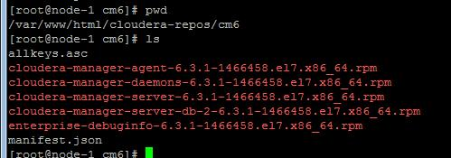

``` shell
# 创建仓库
cd /var/www/html/cloudera-repos/cm6
yum install -y createrepo
createrepo .

# 创建repo文件（所有节点）
vi /etc/yum.repos.d/cloudera-manager.repo
[cloudera-manager]
name=Cloudera Manager 6.3.1
baseurl=http://master/cloudera-repos/cm6
gpgkey=https://archive.cloudera.com/cm6/6.3.1/redhat7/yum/RPM-GPG-KEY-cloudera
gpgcheck=0
enabled=1
autorefresh=0
type=rpm-md

# 清理并缓存（所有节点）
yum clean all
yum makecache

```

## 安装 Cloudera Manager(master节点)

``` shell
# 执行安装
yum install -y cloudera-manager-daemons  cloudera-manager-server
# 安装完CM后/opt/ 下会出现cloudera目录
```

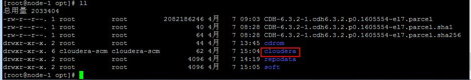

``` shell
#上传CDH-6.3.2-1.cdh6.3.2.p0.1605554-el7.parcel到/opt/cloudera/parcel-repo目录
mv CDH-6.3.2-1.cdh6.3.2.p0.1605554-el7.parcel /opt/cloudera/parcel-repo/
```

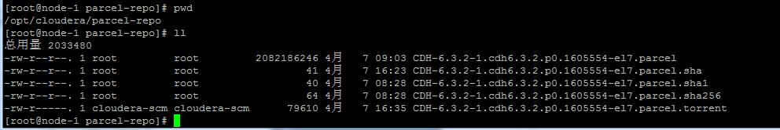

```shell
# 执行校验
sha1sum CDH-6.3.2-1.cdh6.3.2.p0.1605554-el7.parcel | awk '{ print $1 }' > CDH-6.3.2-1.cdh6.3.2.p0.1605554-el7.parcel.sha
# 执行CM初始化脚本
/opt/cloudera/cm/schema/scm_prepare_database.sh mysql scm scm scmscm
```

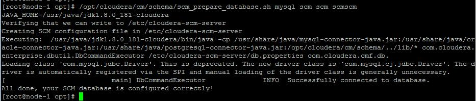

```shell
# 启动服务
systemctl start cloudera-scm-server.service
# 查看服务状态为启动
systemctl status cloudera-scm-server.service
```

# 完成安装

浏览器访问 http://master:7180/

用户名密码：admin/admin

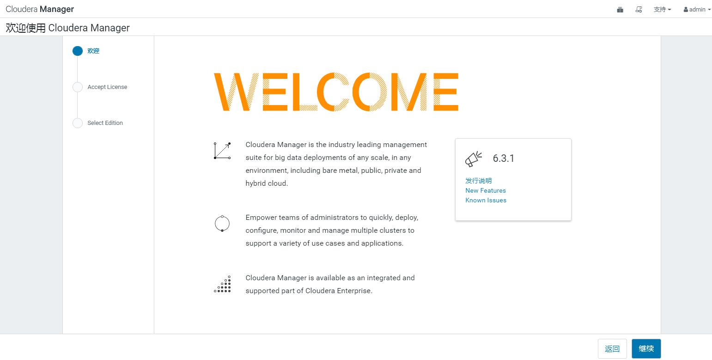

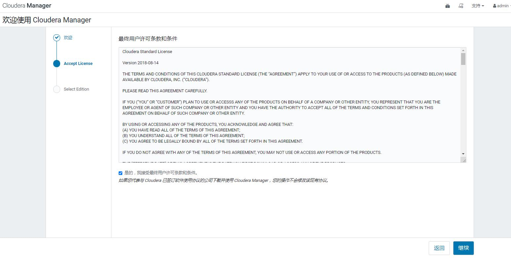

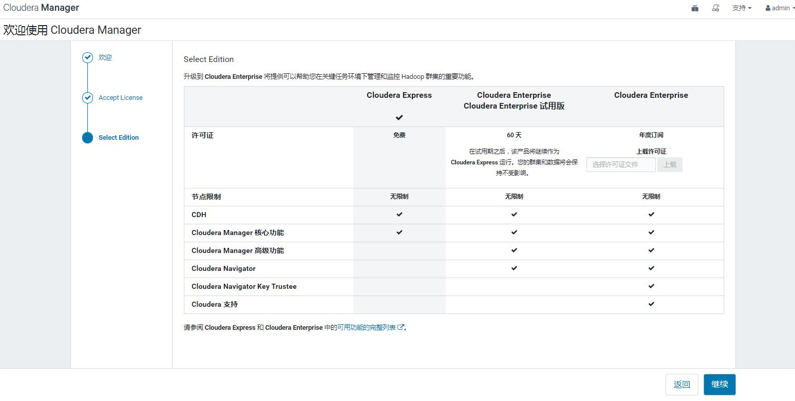

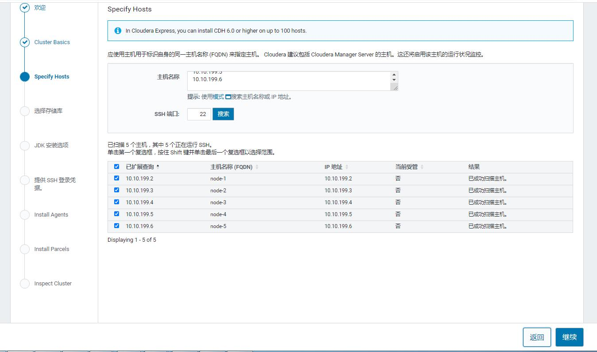

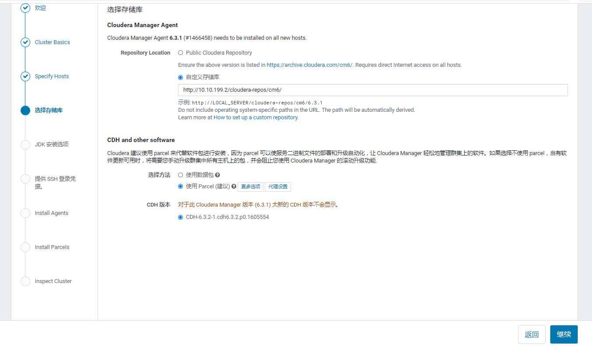

***无需安装JDK***

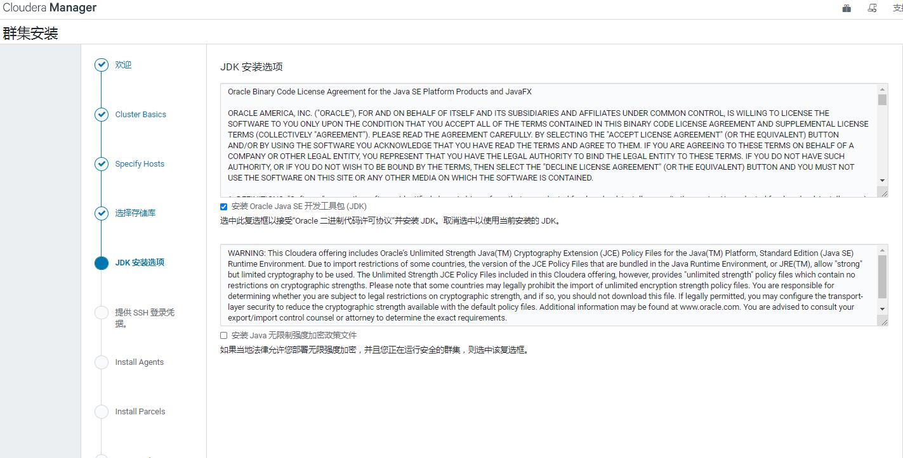

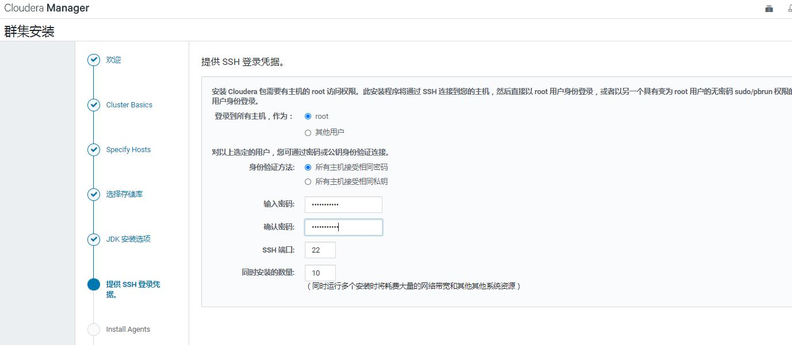

***如果这部安装失败就移除 agent 并重启服务器
yum remove -y cloudera-manager-agent
reboot #重启后一定要注意事前禁用了防火墙***

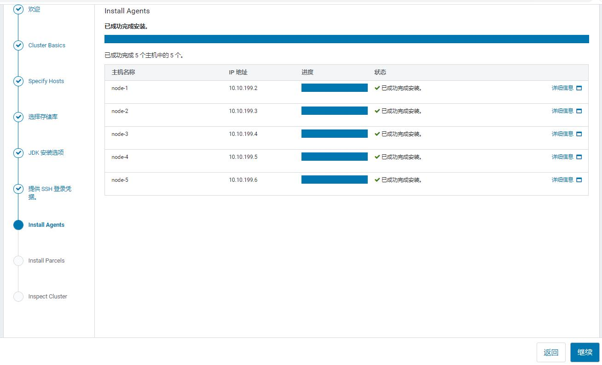

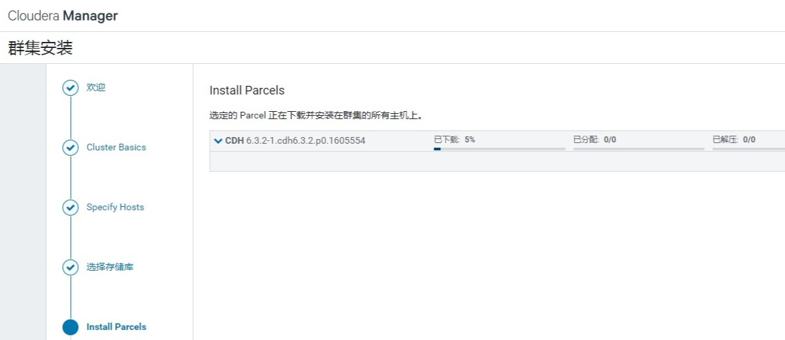

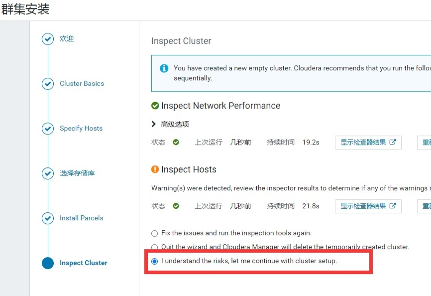

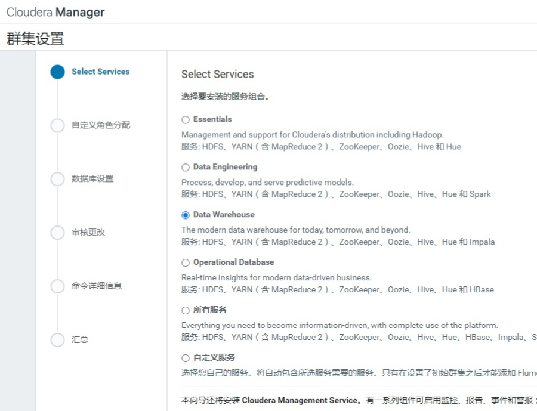

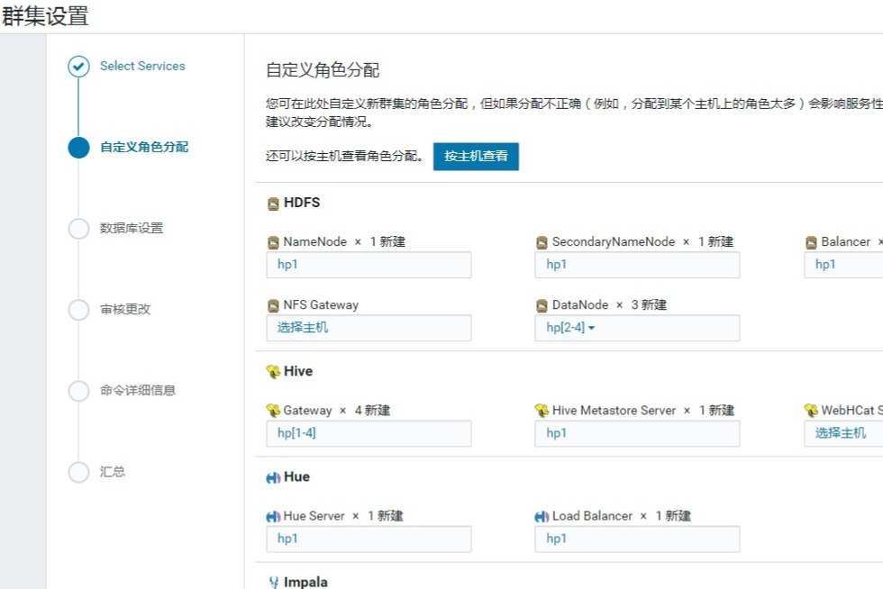

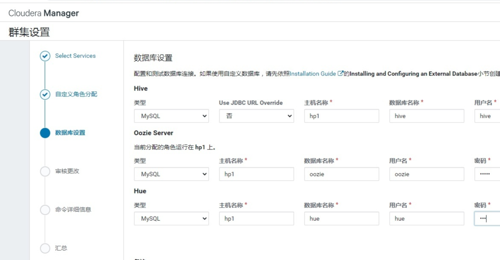

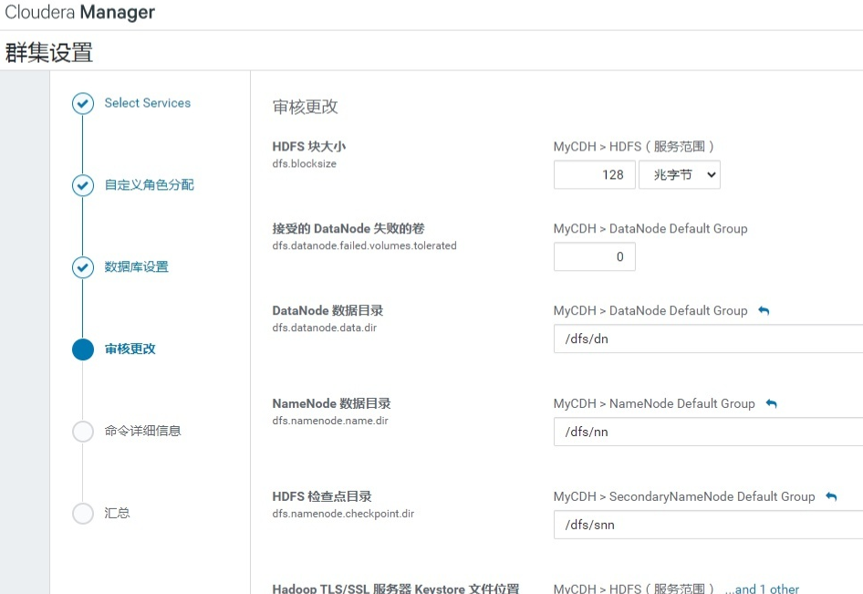
***完成安装***
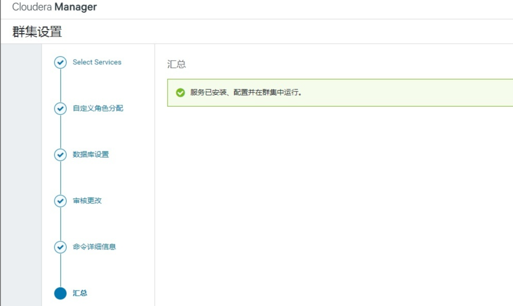

